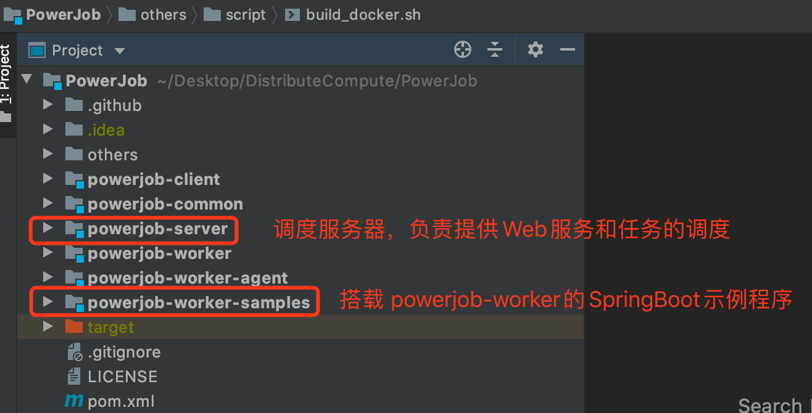
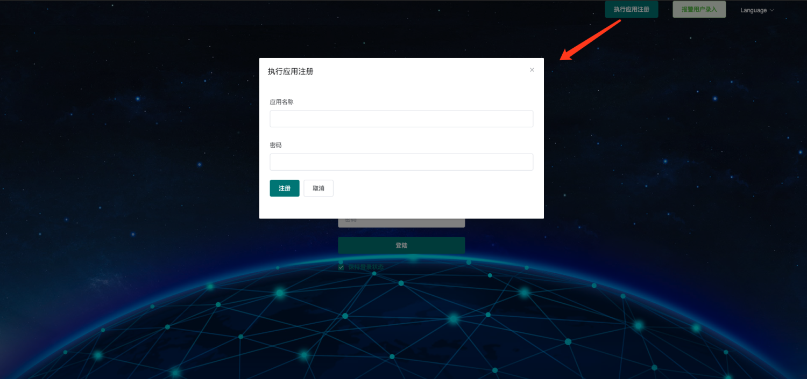
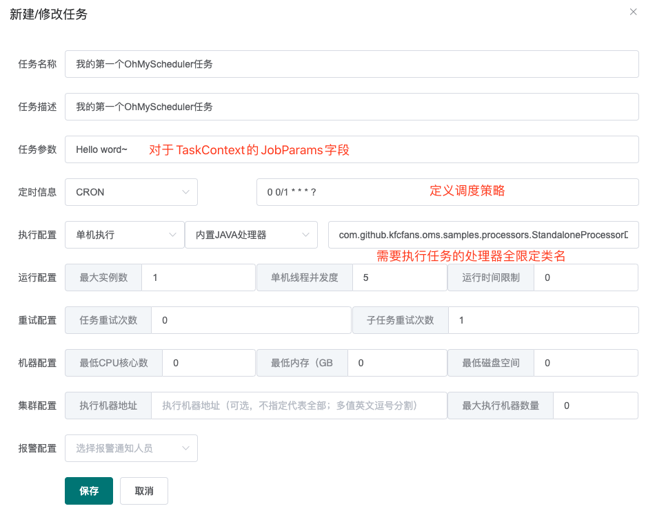
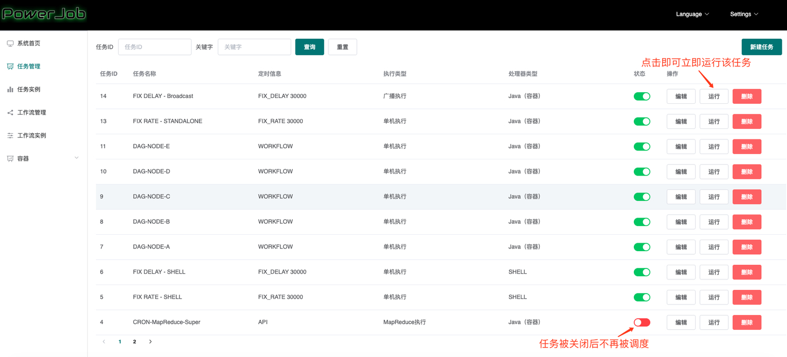
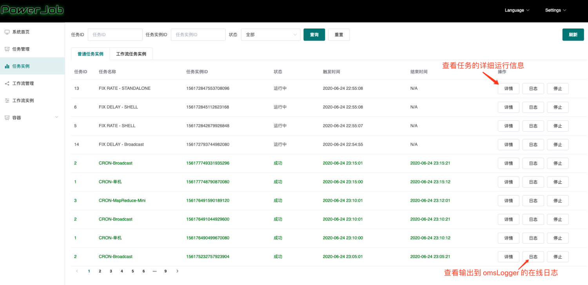

## Java 分布式任务调度平台：PowerJob 快速开始+配置详解
> 本文适合有 Java 基础知识的人群


作者：HelloGitHub-**Salieri**

## 引言

HelloGitHub 推出的[《讲解开源项目》](https://github.com/HelloGitHub-Team/Article)系列。

> 项目地址：
>
> https://github.com/KFCFans/PowerJob

PowerJob 的设计目标为企业级的分布式任务调度平台，即成为公司内部的调度中间件。整个公司统一部署调度中心 powerjob-server，旗下所有业务线应用只需要依赖 'powerjob-worker' 即可接入获取任务调度与分布式计算能力。

因此，PowerJob 由调度服务器（powerjob-server）和执行器（powerjob-worker）两部分组成，powerjob-server 负责提供 Web 服务和完成任务的调度，powerjob-worker 则负责执行用户所编写的任务代码，同时提供分布式计算能力。

以下为在本地开发环境快速搭建并试用 PowerJob 的教程。

## 一、STEP1: 初始化项目

1. `git clone https://github.com/KFCFans/PowerJob.git`
2. 导入 IDE，源码结构如下，我们需要启动调度服务器（powerjob-server），同时在 samples 工程中编写自己的处理器代码
    


## 二、STEP2: 启动调度服务器
1. 创建数据库（不需要建表，只需要创建数据库）powerjob-daily

2. 修改配置文件，配置文件的说明[官方文档](https://www.yuque.com/ohmyscheduler/guidence/bdvp1u#4DTFD)写的非常详细，此处不再赘述。由于是在本地 IDE 搭建测试环境，因此我们选择使用开发环境的配置文件 `application-daily.properties` 来修改并使用。需要修改的地方为数据库配置：
    - `spring.datasource.core.jdbc-url`
    - `spring.datasource.core.username`
    - `spring.datasource.core.password`
    - 当然，有 mongoDB 的同学也可以修改 `spring.data.mongodb.uri` 以获取完全版体验。

3. 完成配置文件的修改后，可以直接通过启动类 `OhMyApplication` 启动调度服务器，观察启动日志，查看是否启动成功～启动成功后，访问 http://127.0.0.1:7700/ ，如果能顺利出现 Web 界面，则说明调度服务器启动成功！

4. 注册应用：点击主页**应用注册**按钮，填入 `powerjob-agent-test` 和控制台密码（用于进入控制台），注册示例应用（当然你也可以注册其他的 appName，只是别忘记在示例程序中同步修改～）
    

## 三、STEP3: 编写示例代码

> 进入示例工程（powerjob-worker-samples），修改配置文件连接 powerjob-server 并编写自己的处理器代码。

1. 修改 powerjob-worker-samples 的启动配置类 `OhMySchedulerConfig`，**将  `appName` 修改为刚刚在控制台注册的名称**。

2. 编写自己的处理器：在示例工程中新建一个类，继承你想要使用的处理器（各个处理器的介绍可见[官方文档](https://www.yuque.com/ohmyscheduler/guidence/hczm7m)），这里为了简单演示，选择使用单机处理器 `BasicProcessor` ，以下代码示例演示了在线日志功能的使用。
    ```java
    @Slf4j
    @Component
    public class StandaloneProcessorDemo implements BasicProcessor {

        @Override
        public ProcessResult process(TaskContext context) throws Exception {

            OmsLogger omsLogger = context.getOmsLogger();
            omsLogger.info("start process,context is {}.", context);
            System.out.println("jobParams is " + context.getJobParams());
            
            return new ProcessResult(true, "process successfully~");
        }
    }
    ```

3. 启动示例程序，即直接运行主类 `SampleApplication`，观察控制台输出信息，判断是否启动成功。

## 四、STEP4: 任务的配置与运行

调度服务器与示例工程都启动完毕后，再次前往 Web 页面（ http://127.0.0.1:7700/ ），进行任务的配置与运行。

1. 在首页输入框输入配置的应用名称，成功操作后会正式进入前端管理界面。
    

2. 点击任务管理 -> 新建任务（右上角），开始创建任务。
    
    
3. 完成任务创建后，即可在控制台看到刚才创建的任务，如果觉得等待调度太过于漫长，可以直接点击**运行**按钮，立即运行本任务。
    

4. 前往**任务示例**边栏，查看任务的运行状态和在线日志
    


### 4.1 基本配置
- 任务名称：名称
- 任务描述：描述
- 任务参数：任务处理时能够获取到的参数（即各个 Processor的process 方法入参 `TaskContext` 对象的 jobParams 属性）（进行一次处理器开发就能理解了）
- 定时信息：该任务的触发方式，由下拉框和输入框组成
- API -> 不需要填写任何参数，表明该任务由 OpenAPI 触发
- CRON -> 填写 CRON 表达式（[在线生成网站](https://cron.qqe2.com/)）
- 固定频率 -> 填写整数，单位**毫秒**
- 固定延迟 -> 填写整数，单位**毫秒**
- 工作流 -> 不需要填写任何参数，表明该任务由工作流（workflow）触发

### 4.2 执行配置
由执行类型（单机、广播和 MapReduce）、处理器类型和处理器参数组成，后两项相互关联。

- 内置 Java 处理器 -> 填写该处理器的**全限定类名**（eg，`com.github.kfcfans.oms.processors.demo.MapReduceProcessorDemo`）
- Java（容器） -> 填写**容器ID#处理器全限定类名**（eg，`18#com.github.kfcfans.oms.container.DemoProcessor`）
- SHELL -> 填写需要处理的脚本（直接复制文件内容）或脚本下载链接（http://xxx）
- PYTHON -> 填写完整的 python 脚本或下载链接（http://xxx）

### 4.3 运行配置
- 最大实例数：该任务同时执行的数量
- 单机线程并发数：该实例执行过程中每个 Worker 使用的线程数量（MapReduce 任务生效，其余无论填什么，都只会使用必要的线程数...）
- 运行时间限制：限定任务的最大运行时间，超时则视为失败，单位**毫秒**，0 代表不限制超时时间（**不建议不限制超时时间**）。

### 4.4 重试配置

- Instance 重试次数：实例级别，失败了整个任务实例重试，会更换 TaskTracker（本次任务实例的Master节点），代价较大，大型 Map/MapReduce 慎用。
- Task重试次数：Task 级别，每个子 Task 失败后单独重试，会更换 ProcessorTracker（本次任务实际执行的 Worker 节点），代价较小，推荐使用。
- 注：**请注意同时配置任务重试次数和子任务重试次数之后的重试放大**，比如对于单机任务来说，假如任务重试次数和子任务重试次数都配置了 1 且都执行失败，实际执行次数会变成 4 次！推荐任务实例重试配置为 0，子任务重试次数根据实际情况配置。

### 4.5 机器配置
用来标明允许执行任务的机器状态，避开那些摇摇欲坠的机器，0 代表无任何限制。

- 最低 CPU 核心数：填写浮点数，CPU 可用核心数小于该值的 Worker 将不会执行该任务。
- 最低内存（GB）：填写浮点数，可用内存小于该值的 Worker 将不会执行该任务。
- 最低磁盘（GB）：填写浮点数，可用磁盘空间小于该值的 Worker 将不会执行该任务。

### 4.6 集群配置

- 执行机器地址：指定集群中的某几台机器执行任务（debug 的好帮手），多值英文逗号分割，如`192.168.1.1:27777,192.168.1.2:27777`
- 最大执行机器数量：限定调动执行的机器数量

### 4.7 报警配置
选择任务执行失败后报警通知的对象，需要事先录入。


基础的教程到这里也就结束了～更多功能示例可见[官方文档](https://www.yuque.com/ohmyscheduler/guidence/ysug77)，工作流、MapReduce、容器等高级特性等你来探索！

## 五、总结与预告

本章详细介绍了 PowerJob 的快速入门，根据本文能够快速搭建起本地开发/测试环境。下一章节，我将会对PowerJob 整体的架构做一个介绍，为后面的技术剖析做准备。

那我们下期再见喽～

## 作者游记


“常在河边走，哪有不湿鞋”，然而，这句话在茶卡盐湖却属于奢望。

稍有不慎，隐秘的盐窟便对你敞开怀抱，瞬间将你吞噬～

盐湖如此，人生亦是如此。

难免不幸时，也要对着美好的明天微笑～