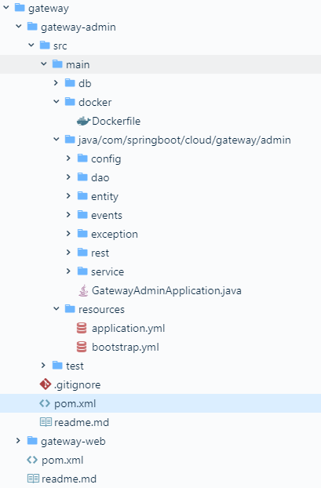
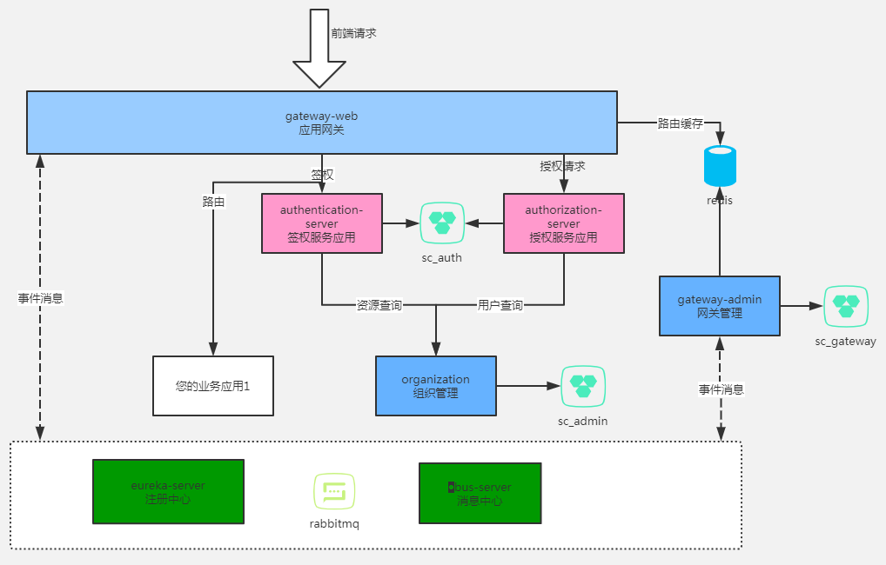
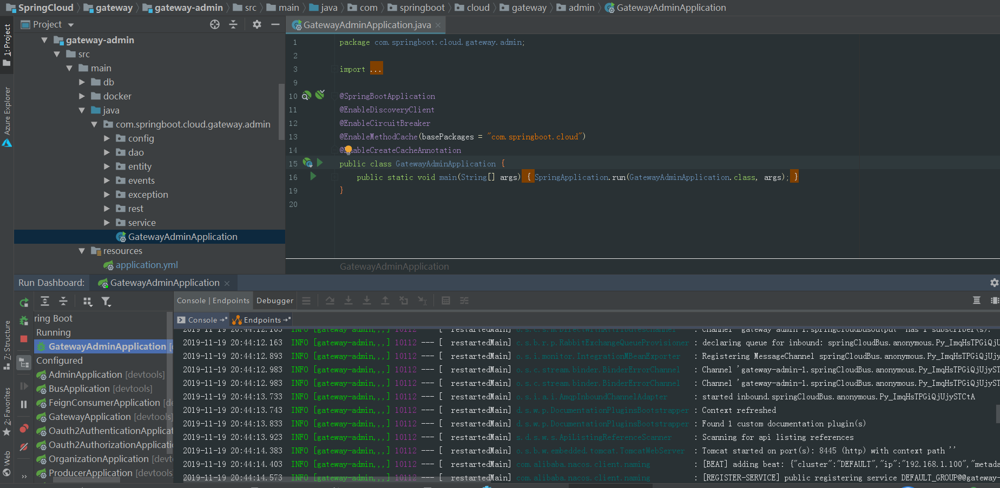
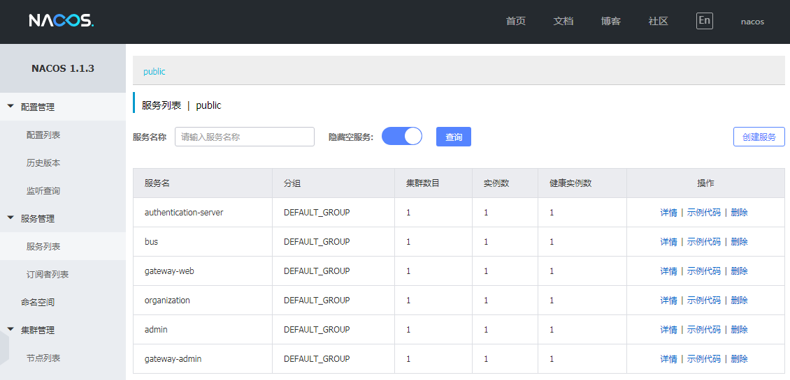
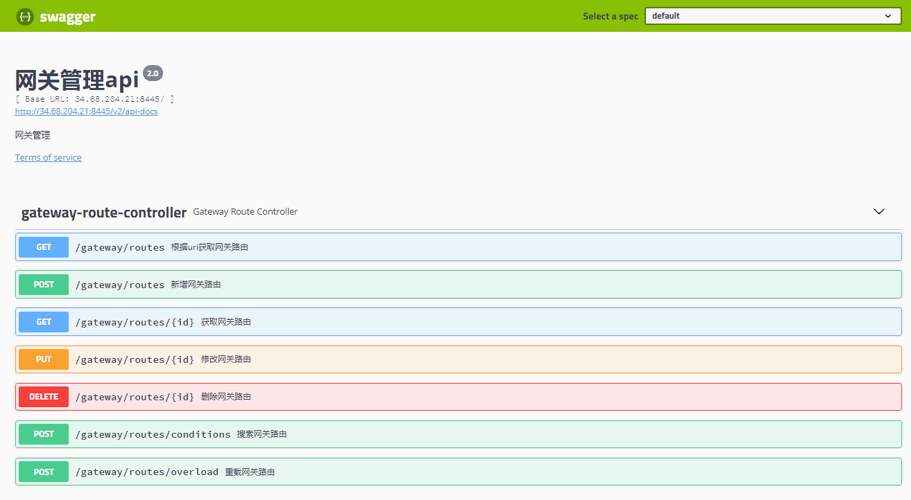

# SpringCloud微服务开发从零到入门

> 本文适合刚学习完 Java 语言基础的人群，跟着本文可了解和使用 SpringCloud 项目。

<p align="center">本文作者：HelloGitHub-<strong>秦人</strong></p>

HelloGitHub 推出的[《讲解开源项目》](https://github.com/HelloGitHub-Team/Article)系列，今天给大家带来一款基于 Java 语言的微服务开源项目——**SpringCloud** 

> 项目源码地址：<https://github.com/zhoutaoo/SpringCloud> 



## 一、微服务的简介

微服务是可以独立部署，水平扩展，独立访问的服务单元，Java 中最小的微服务单元就是基于 SpringBoot 框架的一个独立项目。一个微服务只做一件事（单一职责），多个微服务才能称之为一个完整的项目或产品。那么多个微服务的就需要来管理， SpringCloud 就是统筹这些微服务的大管家。SpringCloud 是一系列有序框架的集合，简单易懂、易部署易维护的分布式系统开发工具包。

## 二、项目结构

这里以一个网关（gateway-admin）微服务来说明。

项目目录结构如下图：

    

目录说明：

1. db：项目初始化数据库脚本。
2. docker：docker 配置文件目录，将微服务打包为 docker 镜像（image）。
3. config：项目配置信息目录，包括数据库配置，消息转化配置等。
4. dao：数据库操作目录，主要对底层数据进行增删查改。
5. entity：项目实体类目录。
6. events：事件处理目录。
7. exception：异常处理目录，通过面向切面处理全局异常。
8. rest：微服务控制器目录，也就是对外提供的接口。
9. service：微服务业务层目录。
10. GatewayAdminApplication ：微服务 SpringBoot 入口类。
11. resources：项目配置文件目录。
12. test：项目单元测试目录。
13. pom.xml：maven 项目对象模型文件。

## 三、实战操作

### 2.1前提

- 确保本地安装 Git，Java8， Maven。
- 懂一些 SpringMVC 的知识，因为 SpringBoot 是基于 SpringMVC 演化而来的。
- 懂一些 应用容器引擎 Docker ，Docker-compose 的知识。

### 2.2微服务架构说明

一个完整的项目，微服务架构一般包括下面这些服务：

- 注册中心（常用的框架 Nacos，Eureka）
- 统一网关（常用的框架Gateway，Zuul）
- 认证中心（常用技术实现方案 Jwt，Oauth）
- 分布式事务（常用的框架 Txlcn，Seata）
- 文件服务
- 业务服务

### 2.3运行项目

#### 2.3.1本地环境运行

1.基础环境安装

安装 mysql，redis，rabbitmq 

（注：这里自行安装接口，如果觉得本地安装这些工具比较麻烦，可以采用下面 docker 安装步骤）

2.环境运行

```bash
git clone https://github.com/zhoutaoo/SpringCloud.git #克隆项目
```

a.安装认证公共包到本地maven仓库 ，执行如下命令：

```bash
cd common
mvn clean install #安装认证公共包到本地maven仓库
```

b.运行注册中心Nacos

下载 Nacos 到本地，（下载地址：<https://github.com/alibaba/nacos/releases> ）

执行如下命令：

```bash
unzip nacos-server-0.9.0.zip  OR tar -xvf nacos-server-0.9.0.tar.gz
cd nacos/bin
bash startup.sh -m standalone #Linux启动命令
cmd startup.cmd #Windows启动命令
```

c.运行网关服务，认证服务，业务服务等

这里以网关服务为例，直接 GatewayAdminApplication.java 



通过swager 接口测试，能访问如下地址，表示服务启动成功。

<http://localhost:8445/swagger-ui.html> 

说明：

- application.yml 文件主要配置 rabbitmq，redis， mysql 的连接信息。

  内容如下：

```bash
spring:
  rabbitmq:
    host: ${RABBIT_MQ_HOST:localhost}
    port: ${RABBIT_MQ_PORT:5672}
    username: ${RABBIT_MQ_USERNAME:guest}
    password: ${RABBIT_MQ_PASSWORD:guest}
  redis:
    host: ${REDIS_HOST:localhost}
    port: ${REDIS_PORT:6379}
    #password: ${REDIS_PASSWORD:}
    lettuce:
      pool:
        max-active: 300

  datasource:
    driver-class-name: com.mysql.jdbc.Driver
    url: jdbc:${DATASOURCE_DBTYPE:mysql}://${DATASOURCE_HOST:localhost}:${DATASOURCE_PORT:3306}/sc_gateway?characterEncoding=UTF-8&useUnicode=true&useSSL=false
    username: ${DATASOURCE_USERNAME:root}
    password: ${DATASOURCE_PASSWORD:root123}
```

- bootstrap.yml 文件主要配置服务基本信息（端口，服务名称），注册中心地址等。

  内容如下：

  ```bash
  server:
    port: ${SERVER_PORT:8445}
  spring:
    application:
      name: gateway-admin
    cloud:
      nacos:
        discovery:
          server-addr: ${REGISTER_HOST:localhost}:${REGISTER_PORT:8848}
        config:
          server-addr: ${REGISTER_HOST:localhost}:${REGISTER_PORT:8848}
          file-extension: yml
      sentinel:
        transport:
          dashboard: ${SENTINEL_DASHBOARD_HOST:localhost}:${SENTINEL_DASHBOARD_PORT:8021}
  ```

#### 2.3.2docker环境运行

1.基础环境安装

a.docker 命令装

```bash
# 安装redis
docker run -p 6379:6379 --name redis -d docker.io/redis:latest --requirepass "123456" 
# 安装mysql
docker run --name mysql5.7 -p 3306:3306 -e MYSQL_ROOT_PASSWORD=root123 -d docker.io/mysql:5.7
# 安装rabbitmq 
docker run -d -p 15672:15672 -p 5672:5672 -e RABBITMQ_DEFAULT_USER=admin -e RABBITMQ_DEFAULT_PASS=admin --name rabbitmq docker.io/rabbitmq:latest
```

b.docker-compose命令

```bash
cd docker-compose
docker-compose up -d  #docker-compose 安装mysql，redis，rabbitmq 服务
```

2.下载项目到本地

```bash
git clone https://github.com/zhoutaoo/SpringCloud.git #克隆项目
```

3.安装认证公共包到本地maven仓库 ，执行如下命令：

```bash
cd common && mvn install #安装认证公共包到本地maven仓库
```

4.docker-compose运行 Nacos

```bash
cd docker-compose
docker-compose -f docker-compose.yml -f docker-compose.nacos.yml up -d nacos #启动注册中心
```

5.构建消息中心镜像

```bash
cd ./center/bus
mvn package && mvn docker:build
cd docker-compose
#启动消息中心
docker-compose -f docker-compose.yml -f docker-compose.center.yml up -d bus-server
```

需要构建镜像的其他服务有：（注：操作和消息中心镜像构建方式类似）

网关管理服务 （gateway-admin，gateway-web）

组织服务（sysadmin / organization）

认证服务 （auth/ authentication-server ）

授权服务（auth/ authorization-server ）

管理台服务 （monitor/admin ）

#### 3.2.3运行效果

##### 1.nacos 服务中心

所有服务都正常启动，在nacos管理中心可查看，实例数表示运行此服务的个数，值为1可以理解为服务正常启动。



##### 2.查看后台服务

命令行执行：docker ps -a 查看 docker 所有进程信息 


通过 访问微服务对外暴露的接口（swagger），检测服务是否可用。

swager 接口地址：<http://IP:port/swagger-ui.html> 

测试如下图：




## 四、最后

教程至此，你应该对微服务有了一个简单的认识。微服务并不是一门新的技术，而是在老技术的基础上衍生出来的。增加了一些新的特性。但是也不用怕，理解了其原理才是最重要的。

本教程是针对有一定 Java 编程基础，微服务（SpringBoot，SpringCloud，Docker）现在吵得特别火，你是不是也要更新一下自己的技能树了，我们一起来学习微服务吧！

## 参考资料

1.本地安装 Nacos <https://nacos.io/en-us/docs/quick-start.html> 

2.nacos注册中心的使用 <https://my.oschina.net/u/726964/blog/2989480> 

3.docker-compose教程 <https://blog.csdn.net/pushiqiang/article/details/78682323> 

4.Docker技术 <https://blog.csdn.net/qq_43371556/article/details/102631158> 

