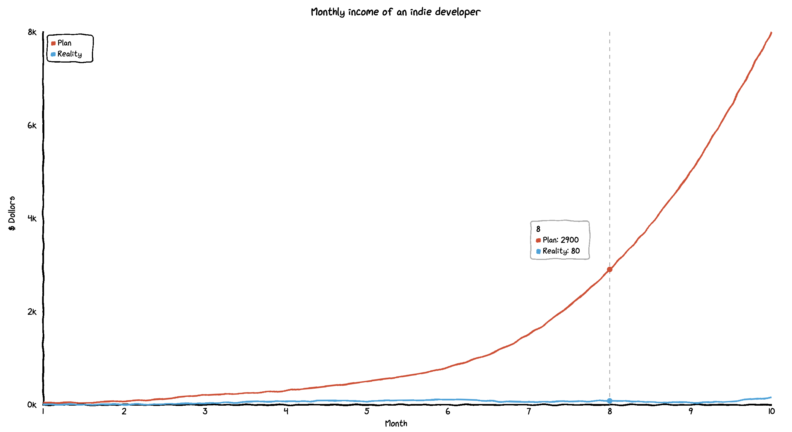
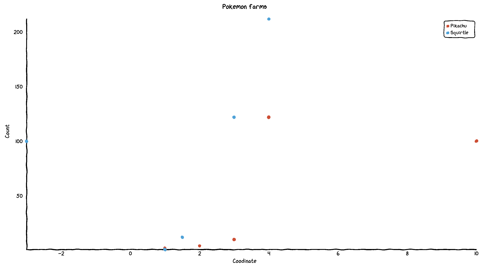
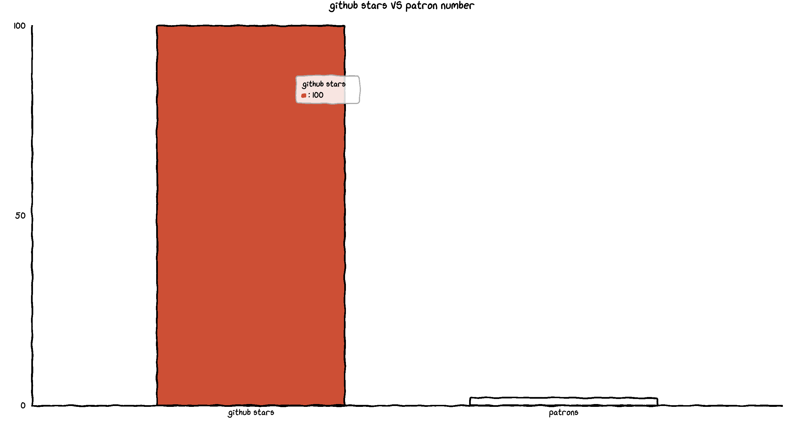
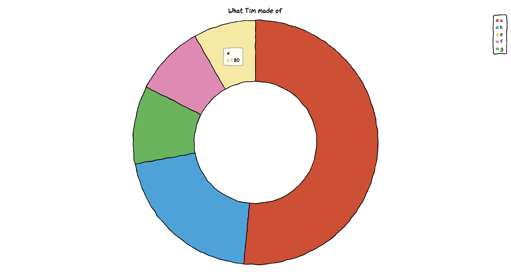
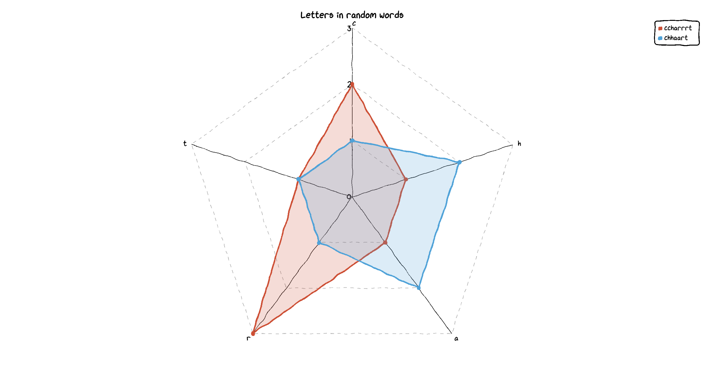

# 手绘风格的JS图表库-Chart.xkcd
<p align="center">本文作者：HelloGitHub-<strong>kalifun</strong></p>  
今天给大家推荐一个手绘风格的 JS 图表库 —— Chart.xkcd。
## 一、介绍

Chart.xkcd是一个图表库，可绘制“概略”，“卡通”或“手绘”样式的图表。

## 二、快速入手

从chart.xkcd开始很容易。只需页面中包含的脚本(CDN方式引入)以及一个用于显示图表的<svg>节点即可。（复制代码便可查看效果）

### 2.1 代码示例

```
<!DOCTYPE html>
<html lang="en">
<head>
    <meta charset="UTF-8">
    <title>Title</title>
</head>
<body>
<!--将 SVG 元素直接嵌入 HTML 页面中-->
<svg class="line-chart"></svg>
<!--引入js库-->
<script src="https://cdn.jsdelivr.net/npm/chart.xkcd@1.1/dist/chart.xkcd.min.js"></script>
<script>
	//关键代码块
  const svg = document.querySelector('.line-chart')
  new chartXkcd.Line(svg, {
    title: '',
    xLabel: '',
    yLabel: '',
    data: {...},
    options: {},
  });
</script>
</body>
</html>
```

### 2.2 参数说明

- title：图表的标题
- xLabel：图表的x标签
- yLabel：图表的y标签
- data：需要可视化的数据
- options：自定义设置

## 三、图表类型

### 3.1 折线图

折线图以折线形式显示一系列数据点。它可以用于显示趋势数据或不同数据集的比较。

```
<!DOCTYPE html>
<html lang="en">
<head>
    <meta charset="UTF-8">
    <title>Title</title>
</head>
<body>
<!--将 SVG 元素直接嵌入 HTML 页面中-->
<svg class="line-chart"></svg>
<!--引入js库-->
<script src="https://cdn.jsdelivr.net/npm/chart.xkcd@1.1/dist/chart.xkcd.min.js"></script>
<script>
    // querySelector() 方法返回文档中匹配指定 CSS 选择器的一个元素。获取文档中 class=".line-chart" 的元素。
    const svg = document.querySelector('.line-chart');

    //chartXkcd.Line 创建一个折线图
    const lineChart = new chartXkcd.Line(svg, {
        //图表的标题
        title: 'Monthly income of an indie developer',
        // 图表的x标签
        xLabel: 'Month',
        // 图表的y标签
        yLabel: '$ Dollors',
        // 需要可视化的数据
        data: {
            // x轴数据
            labels: ['1', '2', '3', '4', '5', '6', '7', '8', '9', '10'],
            // y轴数据
            datasets: [{
                // 第一组数据
                label: 'Plan',
                data: [30, 70, 200, 300, 500, 800, 1500, 2900, 5000, 8000],
            }, {
                // 第二组数据
                label: 'Reality',
                data: [0, 1, 30, 70, 80, 100, 50, 80, 40, 150],
            }],
        },
        // 可选配置以自定义图表的外观
        options: {
            // 自定义要在y轴上看到的刻度号（默认为3）
            yTickCount: 3,
            // 指定要放置图例的位置
            legendPosition: chartXkcd.config.positionType.upLeft
        }
    });
</script>
</body>
</html>
```



#### 3.1.1 参数说明

- yTickCount：自定义要在y轴上看到的刻度号（默认为3）
- legendPosition：指定要放置图例的位置（默认为chartXkcd.config.positionType.upLeft）。
  - 左上位置：chartXkcd.config.positionType.upLeft
  - 顶右上位置：chartXkcd.config.positionType.upRight
  - 左下位置：chartXkcd.config.positionType.downLeft
  - 右下位置：chartXkcd.config.positionType.downRight
- dataColors：不同颜色的数据集数组
- fontFamily：定制图表中使用的字体系列
- unxkcdify：禁用xkcd效果（默认为false）

### 3.2XY图

XY图表用于通过指定点的XY坐标来绘制点，您也可以通过连接这些点来绘制XY折线图。

```
<script>
    // querySelector() 方法返回文档中匹配指定 CSS 选择器的一个元素。获取文档中 class=".xy-chart" 的元素。
    const svg = document.querySelector('.xy-chart');
    //chartXkcd.XY 创建一个XY图
    new chartXkcd.XY(svg, {
        //图表的标题
        title: 'Pokemon farms',
        // 图表的x标签
        xLabel: 'Coodinate',
        // 图表的y标签
        yLabel: 'Count',
        // 需要可视化的数据
        data: {
            datasets: [{
                // 第一组数据
                label: 'Pikachu',
                data: [{ x: 3, y: 10 }, { x: 4, y: 122 }, { x: 10, y: 100 }, { x: 1, y: 2 }, { x: 2, y: 4 }],
            }, {
                // 第二组数据
                label: 'Squirtle',
                data: [{ x: 3, y: 122 }, { x: 4, y: 212 }, { x: -3, y: 100 }, { x: 1, y: 1 }, { x: 1.5, y: 12 }],
            }],
        },
        options: {
            // 自定义要在x轴上看到的刻度号（默认为3）
            xTickCount: 5,
            // 自定义要在y轴上看到的刻度号（默认为3）
            yTickCount: 5,
            // 指定要放置图例的位置
            legendPosition: chartXkcd.config.positionType.upRight,
            // 用线连接点（默认false）
            showLine: false,
            // 指定时间格式
            timeFormat: undefined,
            // 更改点的大小（默认为1）
            dotSize: 1,
        },
    });
</script>
```



如果你想将这些点连接起来，让数据对比更加明显的话。请修改showLine：true，再刷新页面你就可以看到连线的chart了。

#### 3.2.1 参数说明

- xTickCount：自定义要在x轴上看到的刻度号（默认为3）
- yTickCount：自定义要在y轴上看到的刻度号（默认为3）
- legendPosition：指定要放置图例的位置
- showLine: 点连接成线。
- timeFormat：指定时间格式
- dotSize：更改点的大小（默认为1）
- dataColors：不同颜色的数据集数组
- fontFamily：定制图表中使用的字体系列
- unxkcdify：禁用xkcd效果（默认为false）

### 3.3 条形图

条形图提供了一种显示以竖条表示的数据值的方式。

```
<script>
    // querySelector() 方法返回文档中匹配指定 CSS 选择器的一个元素。获取文档中 class=".bar-chart" 的元素。
    const svg = document.querySelector('.bar-chart');
    //chartXkcd.Bar 创建一个条形图
    const barChart = new chartXkcd.Bar(svg, {
        // 图表的标题
        title: 'github stars VS patron number',
        // xLabel: '', // optional
        // yLabel: '', // optional
        // 图表数据
        data: {
            labels: ['github stars', 'patrons'],
            datasets: [{
                data: [100, 2],
            }],
        },
        options: {
            // 自定义要在y轴上看到的刻度号（默认为3）
            yTickCount: 2,
        },
    });
</script>
```



#### 3.3.1 参数说明

- yTickCount：自定义要在y轴上看到的刻度号（默认为3）
- dataColors：不同颜色的数据集数组
- fontFamily：定制图表中使用的字体系列
- unxkcdify：禁用xkcd效果（默认为false）

### 3.4 圆饼/甜甜圈图

```
<script>
    // querySelector() 方法返回文档中匹配指定 CSS 选择器的一个元素。获取文档中 class=".pie-chart" 的元素。
    const svg = document.querySelector('.pie-chart');
    //chartXkcd.Pie 创建一个圆饼图
    const pieChart = new chartXkcd.Pie(svg, {
        // 图表的标题
        title: 'What Tim made of',
        // 需要可视化的数据
        data: {
            labels: ['a', 'b', 'e', 'f', 'g'],
            datasets: [{
                data: [500, 200, 80, 90, 100],
            }],
        },
        options: {
            // 指定空的饼图半径
            innerRadius: 0.5,
            // 指定要放置图例的位置
            legendPosition: chartXkcd.config.positionType.upRight,
        },
    });

</script>
```



#### 3.4.1 参数说明

- innerRadius：指定空的饼图半径（默认值：0.5）
  - 需要饼图吗？将innerRadius设置为0
- legendPosition：指定要放置图例的位置
- dataColors：不同颜色的数据集数组
- fontFamily：定制图表中使用的字体系列
- unxkcdify：禁用xkcd效果（默认为false）

### 3.5雷达图

```
<script>
    // querySelector() 方法返回文档中匹配指定 CSS 选择器的一个元素。获取文档中 class=".radar-chart" 的元素。
    const svg = document.querySelector('.radar-chart');
    //chartXkcd.Radar 创建一个雷达图
    const radarChart = new chartXkcd.Radar(svg, {
        // 图表的标题
        title: 'Letters in random words',
        // 需要可视化的数据
        data: {
            labels: ['c', 'h', 'a', 'r', 't'],
            datasets: [{
                label: 'ccharrrt',
                data: [2, 1, 1, 3, 1],
            }, {
                label: 'chhaart',
                data: [1, 2, 2, 1, 1],
            }],
        },
        options: {
            // 在图表中显示图例
            showLegend: true,
            // 点的大小
            dotSize: 0.8,
            // 在每行附近显示标签
            showLabels: true,
            // 指定要放置图例的位置
            legendPosition: chartXkcd.config.positionType.upRight,
            // unxkcdify: true,
        },
    });
</script>
```



#### 3.5.1 参数说明

- showLabels：showLabels：在每行附近显示标签（默认为false）
- ticksCount：ticksCount：自定义要在主行上看到的刻度号（默认为3）
- dotSize：更改点的大小（默认为1）
- showLegend：在图表附近显示图例（默认为false）
- legendPosition：指定要放置图例的位置
- dataColors：不同颜色的数据集数组
- fontFamily：定制图表中使用的字体系列
- unxkcdify：禁用xkcd效果（默认为false）

## 四、参考

[CHART.XKCD 官方文档](https://timqian.com/chart.xkcd/)

[CHART.XKCD项目地址](https://github.com/timqian/chart.xkcd)

