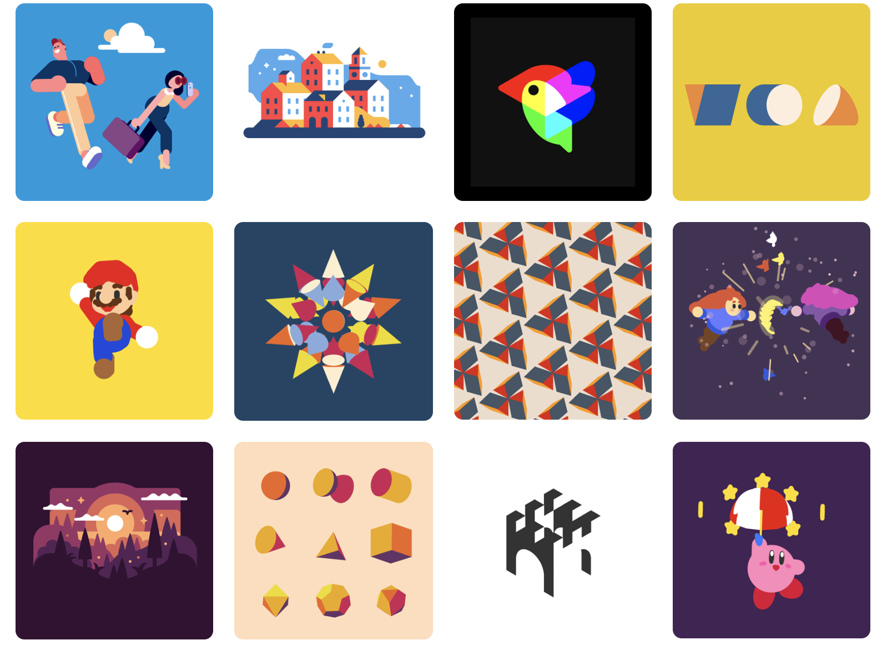

# 成为灵魂画手的引擎-Zdog



<p align="center">本文作者：HelloGitHub-<strong>kalifun</strong></p>  

HelloGitHub 推出的[《讲解开源项目》](https://github.com/HelloGitHub-Team/Article)系列，今天给大家推荐一个 JavaScript 开源的 web 3D 模型项目——Zdog

## 一、介绍

## 1.1 Zdog

> Zdog 项目地址：https://github.com/metafizzy/zdog

**Tips:** 本文出现的所有作品都是通过Zdog完成的。


圆形，扁平，设计师友好用于canvas和SVG的伪3D引擎。

使用 Zdog，您可以在 Web上设计和渲染简单的3D模型。Zdog 是一个伪 3D 引擎。它的几何形状存在于 3D 空间中，但呈现为扁平形状,这使 Zdog 特别。

### 1.2 Zdog特点

- Zdog很小。整个库的2,100行代码，最小体积为28KB。
- Zdog是圆滑。所有的圆形都呈现为圆边，没有多边形锯齿。
- Zdog很友好。使用API完成建模。

## 二、方法介绍

> 解释说明均在代码中以注释方式展示，请大家注意阅读。

###  2.1初始静态演示

让我们进入一个基本的非动画演示。

静态演示只需要在画布上将想要绘画的图像渲染出来就可以了。

```javascript
// Illustration是顶级类，用于处理<canvas>或<svg>元素，保存场景中的所有形状，并在元素中显示这些形状。
    let illo = new Zdog.Illustration({
        // 用class选择器设置画布
        element: '.zdog-canvas',
    });

    // 画圆
    new Zdog.Ellipse({
        // 将形状添加到illo
        addTo: illo,
        // 设置圆的直径
        diameter: 80,
        // 设置画笔宽度
        stroke: 20,
        // 设置圆的颜色
        color: '#636',
    });

    // 更新所有显示属性并渲染到illo画布上
    illo.updateRenderGraph();
```

### 2.2 动画

为实现动画场景，我们需要每帧重新渲染图形在画布上。

```javascript
let illo = new Zdog.Illustration({
        // 用id选择器设置画布
        element: '#zdog-canvas',
    });

    // 画圆
    new Zdog.Ellipse({
        addTo: illo,
        diameter: 80,
        // 你可以理解z轴向前移动40个像素
        translate: { z: 40 },
        stroke: 20,
        color: '#636',
    });

    // 画矩形
    new Zdog.Rect({
        addTo: newcanvas,
        width: 80,
        height: 80,
        // 你可以理解z轴向后移动40个像素
        translate: { z: -40 },
        stroke: 12,
        color: '#E62',
        fill: true,
    });

    function animate() {
        // 通过逐步增加xxx.rotate.y来改变场景的旋转。值越大越快。
        illo.rotate.y += 0.03;
        illo.updateRenderGraph();
        // 动画下一帧继续执行函数
        requestAnimationFrame( animate );
    }
    // 开始动画，执行函数
    animate();
```

### 2.3 放大

Zdog 需要设置大量数字。设置 zoom 将按比例缩放整个场景。

```javascript
// Illustration是顶级类，用于处理<canvas>或<svg>元素，保存场景中的所有形状，并在元素中显示这些形状。
    let illo2 = new Zdog.Illustration({
        // 用class选择器设置画布
        element: '.zdog-canvas2',
         // 将图形放大4倍
        zoom: 4,
    });
    // 画圆
    new Zdog.Ellipse({
        // 将形状添加到illo2
        addTo: illo2,
        // 设置圆的直径
        diameter: 80,
        // 设置画笔宽度
        stroke: 20,
        // 设置圆的颜色
        color: '#636',
    });

    // 更新所有显示属性并渲染到illo画布上
    illo2.updateRenderGraph();
```

### 2.4 拖动旋转

通过在插图上设置 dragRotate：true 来拖动来启用旋转。

```javascript
let newcanvas2 = new Zdog.Illustration({
        // 用id选择器设置画布
        element: '#zdog-canvas2',
        dragRotate: true,
    });

    // 画圆
    new Zdog.Ellipse({
        addTo: newcanvas2,
        diameter: 80,
        // 你可以理解z轴向前移动40个像素
        translate: { z: 40 },
        stroke: 20,
        color: '#636',
    });

    // 画矩形
    new Zdog.Rect({
        addTo: newcanvas2,
        width: 80,
        height: 80,
        // 你可以理解z轴向后移动40个像素
        translate: { z: -40 },
        stroke: 12,
        color: '#E62',
        fill: true,
    });

    function animate2() {
        // 通过逐步增加xxx.rotate.y来改变场景的旋转。值越大越快。
        newcanvas2.rotate.y += 0.03;
        newcanvas2.updateRenderGraph();
        // 动画下一帧继续执行函数
        requestAnimationFrame( animate2 );
    }
    // 开始动画，执行函数
    animate2();
```

## 三、快速入手

下面我们将一步步的讲解如何使用 Zdog 这个库。我们采用的是最简单的 CDN 引用方式，方便大家能够快速体检其魅力（复制代码便可查看效果）。

**Tips：** 解释说明均在代码中以注释方式展示，请大家注意阅读。

```
<!DOCTYPE html>
<html lang="en">
<head>
    <meta charset="UTF-8">
    <title>zdog</title>
    <style type="text/css">
        .zdog-canvas {
            /*给class="zdog-canvas"的画布添加背景*/
            background: #FDB;
        }
    </style>
</head>
<body>
<!--Zdog在<canvas>或<svg>元素上呈现。-->
<!--设置画布1，及长宽-->
<canvas class="zdog-canvas" width="240" height="240"></canvas>
<!--设置画布2，及长宽-->
<canvas id="zdog-canvas" width="240" height="240"></canvas>
<!--引入zdog文件-->
<script src="https://unpkg.com/zdog@1/dist/zdog.dist.min.js"></script>
<script>
    // Illustration是顶级类，用于处理<canvas>或<svg>元素，保存场景中的所有形状，并在元素中显示这些形状。
    let illo = new Zdog.Illustration({
        // 用class选择器设置画布
        element: '.zdog-canvas',
    });

    // 画圆
    new Zdog.Ellipse({
        // 将形状添加到illo
        addTo: illo,
        // 设置圆的直径
        diameter: 80,
        // 设置画笔宽度
        stroke: 20,
        // 设置圆的颜色
        color: '#636',
    });

    // 更新所有显示属性并渲染到illo画布上
    illo.updateRenderGraph();


    let newcanvas = new Zdog.Illustration({
        // 用id选择器设置画布
        element: '#zdog-canvas',
    });

    // 画圆
    new Zdog.Ellipse({
        addTo: newcanvas,
        diameter: 80,
        // 你可以理解z轴向前移动40个像素
        translate: { z: 40 },
        stroke: 20,
        color: '#636',
    });

    // 画矩形
    new Zdog.Rect({
        addTo: newcanvas,
        width: 80,
        height: 80,
        // 你可以理解z轴向后移动40个像素
        translate: { z: -40 },
        stroke: 12,
        color: '#E62',
        fill: true,
    });

    function animate() {
        // 通过逐步增加xxx.rotate.y来改变场景的旋转。值越大越快。
        newcanvas.rotate.y += 0.03;
        newcanvas.updateRenderGraph();
        // 动画下一帧继续执行函数
        requestAnimationFrame( animate );
    }
    // 开始动画，执行函数
    animate();

</script>
</body>
</html>
```


第一个画布是**初始静态演示**，第二个画布是**动画**，第三个画布是由第一个画布**放大**，第四个画布是通过**拖动**实现不规则**旋转**。

## 四、总结

Zdog，可以设计和显示简单的 3D 模型而不需要很多开销。这让我们成为一个灵魂画手简单了很多，如果你想给自己的网站增添色彩，不妨试试 Zdog 吧。如果各位感兴趣的话，下一期我将带领大家成为一位代码上的灵魂画手！

## 五、参考资料

[Zdog官方文档](https://zzz.dog/)


