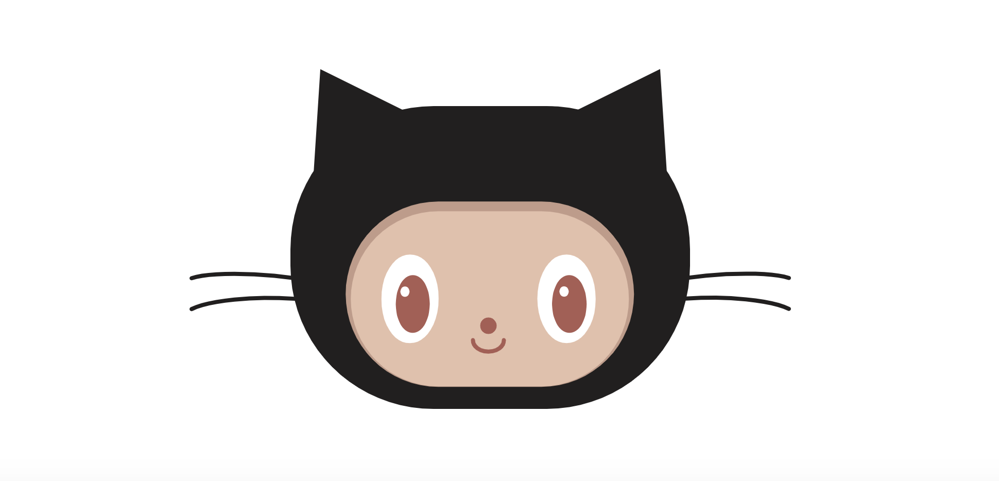
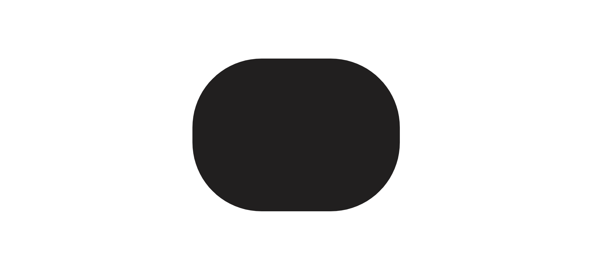
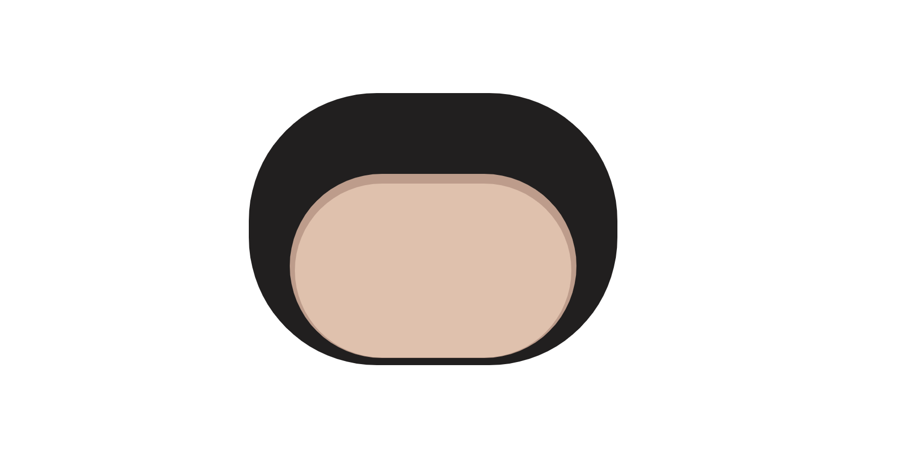
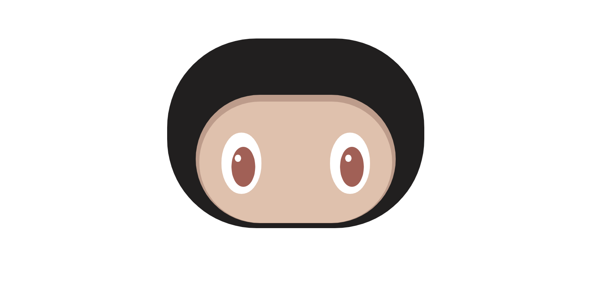
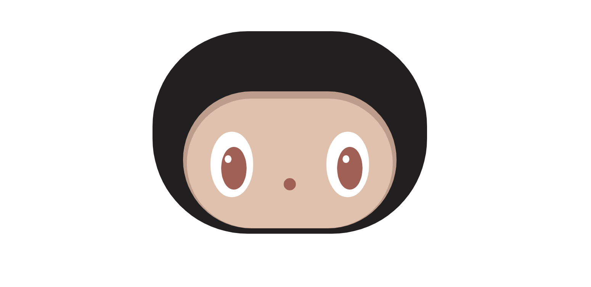
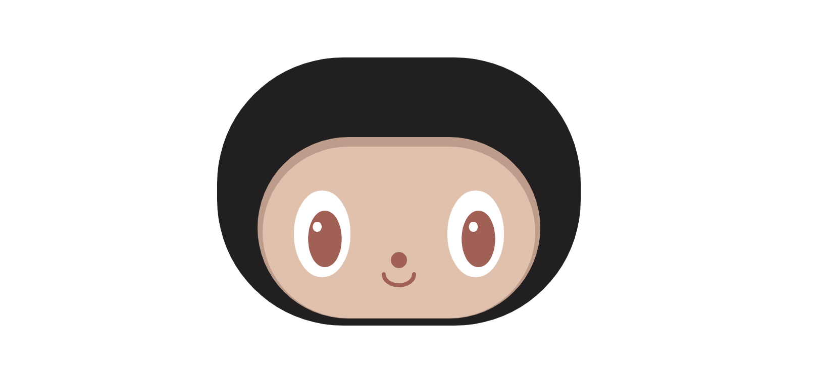
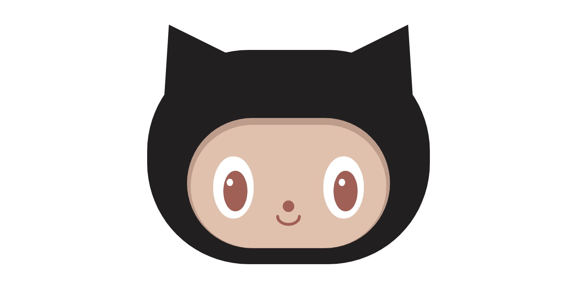
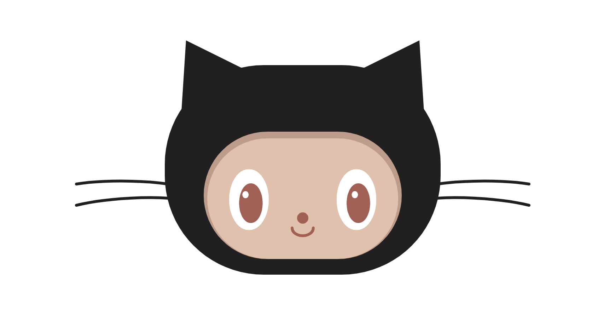

# 教你用开源 JS 框架快速画 GitHub 章鱼猫



<p align="center">本文作者：HelloGitHub-<strong>kalifun</strong></p>

> Zdog 项目地址：https://github.com/metafizzy/zdog

在上一篇文章我们介绍了 Zdog 如何使用，接下来这篇文章我将带领各位利用 Zdog 画出一个 GitHub 章鱼猫（和官方的还是有些差别的）。


## 一、分析

通过上面的动画，我们可以对 GitHub 章鱼猫进行分析，给我们最直观的就是 7 部分。头部、脸、眼睛、鼻子、嘴巴、胡须、耳朵。

- 头部：由一个规则的实体圆角矩形组成。
- 脸：有两个规则的实体圆角矩形组成。第一层是制作阴影，第二层是脸。
- 眼睛：由三个椭圆形组成的眼睛，然后利用复制生成另一只眼睛。
- 鼻子：由一个椭圆形组成。
- 嘴巴：由一个椭圆形变成一个半圆形则是嘴巴啦。
- 胡须：由两条曲线进行复制完成。
- 耳朵：由带圆形底座的方形圆柱组成。

通过上面分析我们需要使用的 API：

- Zdog.Anchor：将多个形状或项目合并成一个项目来进行渲染等。
- Zdog.Group：控制渲染顺序，继承 Anchor，形状将按照添加到组中的顺序呈现。
- Zdog.RoundedRect：圆角矩形，使用 cornerRadius 设置圆角半径。
- Zdog.Cone：带圆形底座的方形圆柱。
- Zdog.Shape：自定义形状的形状类。Shape 的形状由其路径定义。
- Zdog.TAU：以弧度为单位的完整旋转。Math.PI * 2 == TAU，但比 PI 更加友好，因为 TAU 直接映射到完整旋转。
- copy：针对相同的形状进行复制。
- copyGraph：复制带有子项的项目。

## 二、步骤

**Tips：** 解释讲解均在代码中以注释方式展示，请大家注意阅读。

### 2.1 创建画布
是时候开始表演了，首先需要创建画布。代码如下：

```html
<!DOCTYPE html>
<html lang="en">
<head>
    <meta charset="UTF-8">
    <title>GitHub 章鱼猫</title>
    <style>
        .zdog-canvas{
            display: block;
            margin: 0px auto;
        }
    </style>
</head>
<body>
<!--Zdog在<canvas>或<svg>元素上呈现。width和height属性以设置大小。-->
<canvas class="zdog-canvas" width="1200" height="800" style="width: 600px;height: 400px"></canvas>
<!--引入js文件-->
<script src="https://unpkg.com/zdog@1/dist/zdog.dist.min.js"></script>
<script>
		// 1.将选定画布，进行创作
    let illo = new Zdog.Illustration({
        element: ".zdog-canvas",
        dragRotate: true,
    });
    
		//下面是准备的配色
    // 瞳孔的颜色
    const colorFeatures = "#AB5C53";
    // 头的颜色
    const black         = "#211F1F";
    // 阴影的颜色
    const colorShadow   = "#C39B88";
    // 皮肤的颜色
    const colorSkin     = "#E5C0AA";
    // 眼睛最外圈的颜色
    const white         = "#FFF";
    
    //----------------------------
    //下面的所有代码将都在这里书写
    //----------------------------
    
    illo.updateRenderGraph();
</script>
</body>
</html>
```

### 2.2 画头
按照我们之前分解的，先画 GitHub 章鱼猫的头。代码如下：

```javascript
// 可以添加到Zdog场景的所有项目都充当锚点。
const head = new Zdog.Anchor({
    addTo: illo,
    translate: {
            // 向y轴移动
        y: 15
    },
});

// 具有分离渲染顺序的项目。继承Anchor。
const domepiece = new Zdog.Group({
    addTo: head
});

// 真正进行画头，是一个实体矩形
const noggin = new Zdog.RoundedRect({
    addTo: domepiece,
    // 设置高度和宽度
    width: 160,
    height: 66,
    // 渲染形状线并设置线宽。默认笔划：1。
    stroke: 230,
    // 使用cornerRadius设置圆角半径
    cornerRadius: 20,
    // 设置颜色
    color: black,
    path: [
        { x: -4.5 },
        { x: 5.5 }
    ]
});
```

效果如下：



### 2.3 画脸 

面部的实现代码如下：

```javascript
// 我们需要画下一组图形，那就是脸。脸被定义为一组
const face = new Zdog.Group({
    addTo: head,
    // 将阴影部分进行位置的调节
    translate: {
        // x轴我们不动，保持正中
        x: 0,
        // y轴进行往下移动
        y: 36,
        // 为了3D更加真实，我们需要将脸部往外突出一点。这样才更加逼真
        z: 20
    },
});

// 下面我们开始进行阴影的绘画，它是由一个实体矩形组成
const skinShadow = new Zdog.RoundedRect({
    addTo: face,
    // 设置高度和宽度
    width: 100,
    height: 0,
    // 渲染形状线并设置线宽。默认笔划：1。
    stroke: 180,
    //使用cornerRadius设置圆角半径
    cornerRadius: 40,
    // 设置颜色
    color: colorShadow,
});

// 下面开始画脸的部分
const skin = new Zdog.RoundedRect({
    addTo: face,
    // 高宽和上面需要一直，为了产生阴影的效果，我们只需要将我们的画笔的宽度小一点并就可以看到想要的效果。
    width: 100,
    height: 0,
    // 比之前的阴影部分减小一点
    stroke: 170,
    // 圆角半径和阴影部分是一致的
    cornerRadius: 40,
    // 设置颜色
    color: colorSkin,
    // 为了和阴影的下半部分重叠，需要将其往下移动
    translate: {
        y: 4.5
    }
});
```

效果如下：



### 2.4 画眼睛
眼睛部分因为是相同的，所以我们会用到 `copy` 方法，代码如下:

```javascript
// 眼睛最外部分为纯白色
const iris = new Zdog.Ellipse({
    addTo: eye,
    // 渲染内部形状区域
    fill: true,
    width: 40,
    height: 56,
    // 圆角半径
    stroke: 2,
    // 放大或缩小项目几何体
    scale: 1.5,
    color: white,
});

// 瞳孔部分
const pupil = new Zdog.Ellipse({
    addTo: eye,
    // 设置长宽
    width: 37,
    height: 56,
    stroke: 0,
    fill: true,
    color: colorFeatures,
    // 由于它的位置需要更靠近右边
    translate: {
        x: 3,
        y: 5,
        z: 0
    },
});

// 然后是瞳孔里的小白点
const anotherpupil = new Zdog.Ellipse({
    addTo: pupil,
    // 设置宽度
    width: 10,
    height: 10,
    color: white,
    fill: true,
    stroke: 0,
    // 设置位置
    translate: {
        x: -7,
        y: -12,
        z: 3
    }
});

// 这里将刚绘画好的左眼复制出来
const eyeright = eyeleft.copyGraph({
    // 并调整好眼睛的位置
    translate: {
        x: 76,
        y: 6,
        z: 80
    },
    rotate: {
        y: TAU / -14
    }
});
```

效果如下：



### 2.5 画鼻子

代码如下：

```javascript
// 画鼻子部分，相对很简单，因为就是一个圆形
const nose = new Zdog.Ellipse({
    addTo: face,
    // 设置宽度
    width: 6,
    height: 6,
    fill: true,
    stroke: 10,
    // 设置颜色
    color: colorFeatures,
    // 调整位置
    translate: {
        x: 0,
        y: 32,
        z: 74
    },
});
```

效果如下：



### 2.6 画嘴巴

代码如下：

```javascript
//接下来是画嘴巴部分
const mouth = new Zdog.Ellipse({
    addTo: face,
    // 设置圆的直径
    diameter: 30,
    // 将其设置为1/4的圆，我们取值为2，所以获得半圆
    quarters: 2,
    // 设置圆角半径
    stroke: 4,
    // 将半圆进行缩放，使其更加逼真
    scale: {
        x: 0.8,
        y: 1
    },
    color: colorFeatures,
    // 将半圆进行旋转，让开口向上
    rotate: {
        x: TAU / 2.3,
        z: TAU / -4
    },
    // 然后再对其调整合理的位置
    translate: {
        x: 0,
        y: 46,
        z: 74
    },
});
```

效果如下：



### 2.7 画耳朵

```javascript
// 画耳朵
// 带圆形底座的方形圆柱
// 绘画左耳
const ear = new Zdog.Cone({
    addTo: head,
    // 设置圆的直径
    diameter: 120,
    // 设置长度
    length: 90,
    stroke: false,
    color: black,
    // 调整位置
    translate: {
        x: -120,
        y: -105
    },
    // 圆角朝向为正z轴，因此需要对其旋转
    rotate: {
        x: TAU/4,
        y: TAU/12
    },
});

// 绘画右耳，将左耳进行复制，移动，旋转
ear.copy({
    translate: {
        x: 120,
        y: -105
    },
    rotate: {
        x: TAU/4,
        y: TAU/-12
    },
});
```



### 2.8 最后一步画胡须

终于到了最后一步，它即将生灵活现起来。代码如下：

```javascript
// 开始进行画胡须
// shape自定义形状
const whisker = new Zdog.Shape({
    addTo: whiskers,
    path: [
        // 起始点
        { x: 100, y: 0 },
        // 曲线的椭圆适合由前一个拐角和终点形成的矩形。
        { arc: [
                // 拐角
                { x: 30, y: -10 }, // corner
                // 终点
                { x: -30, y: 0 }, // end point
            ]}
    ],
    closed: false,
    // 胡须的宽度
    stroke: 4,
    color: black,
});

// 左侧的另一条胡须，只需要按照上面的设置进行下移即可
whisker.copy ({
    path: [
        { x: 100, y: 0 },
        { arc: [
                { x: 30, y: -5 }, // corner
                { x: -30, y: 10 }, // end point
            ]}
    ],
    // 将胡须往下移
    translate: {
        y: 20
    },
});

// 将左侧的胡须复制进行移动并旋转
const whiskersright = whiskersleft.copyGraph({
    translate: {
        x: 290,
        y: 20
    },
    rotate: {
        y: TAU/2,
    },
});
```

完成效果如下：



## 三、总结

当我们对代码进行分析时，其实感觉并没有想象中的复杂，我们需要精心去进行分析。把需要的形状先构思好，然后再参考 zdog 文档，有没有快捷的方式获得你想要的形状。

阅读完本文后 “灵魂小画师” 是否从此诞生了呢？✌️

## 四、参考资料

- [Zdog 官方文档](https://zzz.dog/)

- [效果来源](https://www.17sucai.com/preview/1750622/2019-08-08/ztocat/index.html)