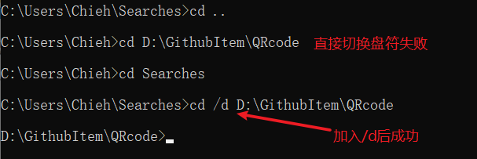
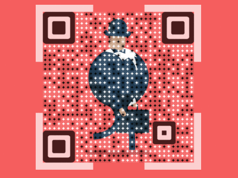

# 用 Python 生成有“灵魂”的二维码


<p align="center">本文作者：HelloGitHub-<strong>LITTLECHIEH</strong></p>

这是 HelloGitHub 推出的[《讲解开源项目》](https://github.com/HelloGitHub-Team/Article)系列，今天给大家推荐一个 Python 开源生成二维码的项目——qrcode

## 一、介绍

### 1.1 二维码

二维码又称二维条码，常见的二维码为 QR Code，QR 全称 Quick Response。是一个近几年来移动设备上超流行的一种编码方式，在现在的生活中二维码随处可见。我们可以用它支付、浏览网站等，为什么他会这么流行？下面说几个特点：
1. 可存储的信息量大：可容纳多达 1850 个大写字母或 2710 个数字或 1108 个字节或 500 多个汉字。
2. 容错能力强：具有纠错功能，这使得二维条码因穿孔、污损等引起局部损坏时，照样可以正确得到识读，损毁面积达 30% 仍可恢复信息。
3. 译码可靠性高：它比普通条码译码错误率百万分之二要低得多，误码率不超过千万分之一。
4. 激光可识别。

比如我们现在常见的公众号二维码，他就利用了二维码容错能力强的特点，在二维码中间加入了公众号的图标。虽然中间的图片遮盖了一部分二维码的真实数据，但因为其强大的容错能力，所以并没有影响二维码要传递的数据。

### 1.2 二维码的组成


一图胜千言，好了这里二维码的基本知识就介绍完成了。

### 1.3 生成二维码库
二维码是一个很方便的传递信息的载体，但是像上面黑白的二维码感觉非常缺少‘灵魂’。下面就介绍今天的主角：qrcode

这是一个由 Python 编写的二维码生成器，支持生成 GIF 动态、图片二维码，让你的二维码变得有趣起来。

> 项目地址：https://github.com/sylnsfar/qrcode

## 二、qrcode 库的优点

为什么需要使用到这个二维码生成器来生成二维码呢？

1. 使用简单：快速上手，仅需 2 行代码，即可开始使用！
2. 在二维码中增加图片：可以让用户通过二维码中的图片，初步了解该二维码是和什么东西有关。（该二维码加入了 HG 的 logo）
   
    

3. 在二维码中增加动图：通过动图，让二维码活过来。
   
    

4. 使用方式多样：有以下的 3 种使用方式
    - 命令行方式
    - 导入文件方式（import）
    - [可执行文件](https://github.com/sylnsfar/qrcode_win)
5. 用就对了：我不要你觉得，我要我觉得 ~~滑稽~~


## 三、快速上手
> 演示环境
>
> 操作系统：Windows | Python 版本：3.5


### 3.1 安装
我们通过 Python 的 pip 包管理工具进行安装：

```bash
pip install myqr
```

> 注：此处可能需要升级 pip，升级命令 `pip install --upgrade pip`

安装完成之后，就可以直接在命令行中使用了！下面逐一讲解各种二维码的生成方法

### 3.2 普通二维码

首先生成一个普通二维码

1. 打开 cmd

2. 输入命令
    ```bash
    myqr https://github.com -n helloword.png
    ```
    参数 `-n`：生成二维码的文件名

这样就会得到一个二维码图片，生成的图片保存在了当前目录，后面可以通过传入参数修改默认目录。

### 3.3 彩色二维码

1. 先准备一张图片放在目录下（**方形**的图片效果最好）

    

2. 将图片名称修改为 github.jpg（后缀根据自己的照片格式而定）

3. 在命令行中输入：
    ```bash
    myqr https://github.com -n mypicture.png -p github.jpg -c
    ```
    参数：
    - `-n`：生成二维码的名称
    - `-p`：二维码加入的图片，支持 jpg、gif、png 格式
    - `-c`：选择是否生成彩色二维码，如果不设置默认为黑白
    - 更多参数请看下面附录部分

### 3.4 动态二维码

步骤和彩色二维码的方法一致，但是需要注意：
1. 增加图片为 gif
2. 修改生成二维码的后缀为 gif

## 四、附录

### 4.1 MyQR 参数

从官方文档整理的常用参数如下：

- `-n`：生成二维码的名称
- `-p`：二维码加入的图片，支持`.jpg`、`.gif`、`.png`、`.bmp` 格式
- `-c`：选择是否生成彩色二维码，如果不设置默认为黑白
- `-v`：控制边长，范围是 1 至 40，数字越大边长越大
- `-l`：控制纠错水平，范围是 L、M、Q、H 从左到右依次升高
- `-d`：控制输出二维码的存储位置
- `-con`：用以调节图片的对比度，1.0 表示原始图片，更小的值表示更低对比度，更大反之。默认为 1.0
- `-bri`：用来调节图片的亮度，其余用法和取值与 `-con` 相同

### 4.2 cmd 切换盘符

打开命令行有个小技巧，可以将 cmd 迅速切换到想要的目录，避免了切换盘符的麻烦：

1. 利用文件管理，找到目标文件夹

2. 顶部地址栏输入 cmd，然后‘回车‘

    

3. 切换盘符的坑：直接切换盘符会失败

    

### 4.3 二维码分类介绍

二维码有以下几种分类

1. 黑白和彩色码
   - 黑白码
   - 彩色码
2. 融合和视觉码
    - 融合码：就是将内容与二维码融合使它们成为一个整体，图片由二维码组成，二维码就是图片的一部分。这种比较适合使用构造简单的图片或者文字做美化主体内容
    - 视觉码：以图片为背景，再在图片上构建很多特殊的点，这些点不会影响背景的视觉效果

        
3. 艺术码
   - 艺术二维码，就是将二维码进行的各个“码眼”按照设计师的构思进行分析、拆解、合并，再在那些“码眼”区域填充上一些小素材元素，最后形成一个别具特色二维码。
        

## 五、最后
以上就是本篇文章的全部内容了，相信你对二维码更加了解了。并且对 qrcode 库的常用参数有了一定了解，那就快去生成一个有趣、有‘灵魂’的二维码吧！

有好玩的库，但不会用，看着干着急？欢迎告诉我们，同时也欢迎加入我们。我们的愿景：
“让对开源感兴趣的人不再畏惧，开源项目的发起者不再孤单。”


## 六、参考资料

- [小技巧｜还在用黑白二维码？弱爆了！教你点新的技能！](https://www.jianshu.com/p/5f8df373be7a)
- [PDF 淺談 QR Code](https://www.csie.ntu.edu.tw/~kmchao/bcc15spr/20150325_QR_Code.pdf)
- [QRcode](https://github.com/sylnsfar/qrcode/blob/master/README-cn.md)
